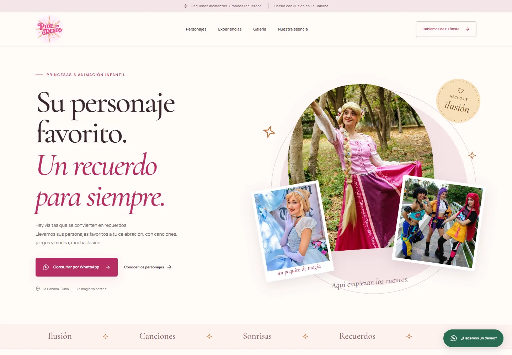

# Validación de la primera versión

Fecha: 3 de octubre de 2026.

## Resultado local

- ESLint y TypeScript: correctos.
- Vitest: 7 pruebas correctas para enlaces de WhatsApp, teléfono, contexto y acentos.
- Playwright con Chrome instalado: 11 pruebas correctas; 1 caso omitido porque
  el menú móvil no se aplica al proyecto de escritorio.
- Tamaños revisados: 360, 390, 768 y 1440 píxeles, sin desbordamiento horizontal.
- Galería: apertura, foco en cerrar, recorrido con Tab, Escape y retorno del foco.
- Contenido y enlaces esenciales disponibles con JavaScript deshabilitado.
- Fotografías publicadas revisadas: solo animadoras y detalles del vestuario.
- Carpeta de originales ignorada; 22 imágenes con niños retiradas; 2 videos conservados
  localmente y excluidos de la publicación.

## Compilación reproducible y vista previa

- Copia limpia con `git archive`: instalación offline, lint, pruebas, tipos y
  compilación correctos sin la carpeta de material privado.
- GitHub Actions: comprobaciones correctas del commit `273d1aa`.
- Pages local: portada 200, ruta inexistente 404 y política CSP aplicada.
- Vista previa real: https://5f4f923e.pideundeseo-cuba.pages.dev.
- HTTPS, imágenes, galería, Escape y retorno del foco correctos; sin errores de
  JavaScript. Sin desbordes a 360, 390, 768 y 1440 px. Respuesta 404 correcta.
- Vista previa marcada `noindex, nofollow`.
- Proyecto conectado a GitHub, producción desde `main`, salida `dist` y
  `SITE_URL` configurada con la dirección real.

## Lighthouse móvil

Auditoría de la compilación de producción servida **localmente**, con Chrome y
el perfil móvil simulado de Lighthouse. Se utilizó `SITE_URL=http://localhost:4173`
solo para comprobar los metadatos de producción; esa dirección no se publicará.

| Categoría        | Puntuación |
| ---------------- | ---------: |
| Rendimiento      |         94 |
| Accesibilidad    |        100 |
| Buenas prácticas |        100 |
| SEO              |        100 |

| Métrica                  | Resultado |
| ------------------------ | --------: |
| First Contentful Paint   |     1,7 s |
| Largest Contentful Paint |     2,9 s |
| Total Blocking Time      |      0 ms |
| Cumulative Layout Shift  |         0 |

Estas mediciones son de laboratorio, no métricas de visitantes reales ni una
garantía de tiempos en redes cubanas. Deben contrastarse con la publicación final.
Los informes completos locales se guardan en `artifacts/lighthouse-mobile.report.html`
y `.json`, ignorados por Git.

## Capturas

Las capturas muestran una ejecución real del sitio, no un mockup.

## Pendiente de publicación

Falta integrar el pull request y verificar la publicación de producción. La prueba de acceso desde una conexión en Cuba requiere una comprobación del usuario.
